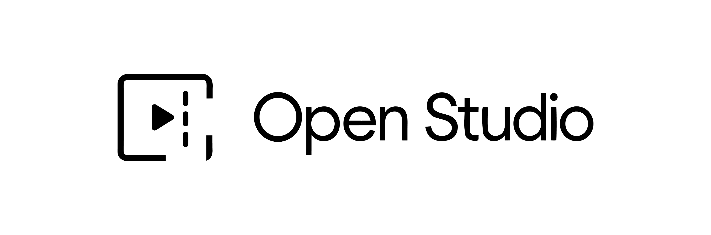

# ✨ Open Studio



> The VS Code of web builders: build, edit, ship and scale from one workspace.

[English](./README.md) | Español

[](https://github.com/bryfar/Open-Studio/actions)
[](./LICENSE)
[](https://github.com/bryfar/Open-Studio/stargazers)
[](./SECURITY.md)
[](./CODE_OF_CONDUCT.md)

## ⚡ Why Open Studio?

| Plataforma | Fortalezas | Limitaciones típicas | Diferencia de Open Studio |
|---|---|---|---|
| Webflow | Diseñador visual y CMS potente | Menor control del stack de ingeniería | Combina flujo visual + control de código + desktop offline |
| Framer | Muy rápido para marketing pages | Menos orientado a pipelines complejos de producto | Enfoque en creación completa: editor pro, build y distribución |
| V0 | Generación veloz de UI con IA | Requiere ensamblar manualmente para producción | Monorepo listo para iterar, testear, deployar y empaquetar |
| Open Studio | Editor + IA + desktop + release pipeline | Setup inicial local | Flujo open source end-to-end para construir y operar productos |

## 🚀 Quick Start

```bash
# 1) Clona el repositorio
git clone https://github.com/bryfar/Open-Studio.git

# 2) Entra al proyecto
cd Open-Studio

# 3) Instala dependencias del monorepo
npm install

# 4) Ejecuta lint base para validar entorno
npm run lint

# 5) Levanta la app web (Next.js)
npm run dev

# 6) Levanta la app desktop (Electron + web)
npm run dev:desktop

# 7) Levanta API de shorts (FastAPI)
npm run dev:api

# 8) Levanta worker de procesamiento
npm run dev:worker
```

## ▲ Deploy

| Opción | Cuándo usarla | Pasos recomendados |
|---|---|---|
| [Vercel](https://vercel.com/) | Deploy rápido del frontend Next.js | 1) Conecta el repo 2) Configura variables 3) Revisa [`vercel.json`](./vercel.json) 4) Habilita deploy por branch/tag |
| [Cloudflare](https://www.cloudflare.com/) | Edge distribution y control de red | 1) Configura proyecto 2) Define variables 3) Ajusta build command/output 4) Verifica rutas y caching |

Checklist de release:

| Paso | Qué validar |
|---|---|
| 1 | Variables y secretos desde [`.env.example`](./.env.example) y `apps/openstudio-shorts-service/.env.example` |
| 2 | Configuración de deploy en [`vercel.json`](./vercel.json) |
| 3 | Calidad mínima: `npm run lint` y `npm run e2e` |
| 4 | Release desktop por tags semver (`v*`) con artefactos por OS |

## 🧭 Understand Fast

1. [`docs/WEB_FEATURE_STRUCTURE.md`](./docs/WEB_FEATURE_STRUCTURE.md)
2. [`docs/EDITOR_ARCHITECTURE.md`](./docs/EDITOR_ARCHITECTURE.md)
3. [`docs/kdenlive-parity-matrix.md`](./docs/kdenlive-parity-matrix.md)
4. [`apps/web/README.md`](./apps/web/README.md)
5. [`apps/desktop/README.md`](./apps/desktop/README.md)
6. [`CONTRIBUTING.md`](./CONTRIBUTING.md)

## 🛠️ Key Capabilities

- 🎬 Timeline editor multi-track (video, audio, texto, overlays)
- ✂️ Clip Generator para convertir videos largos en shorts
- 🤖 AI Shorts con pipeline de generación asistida
- 💾 Persistencia local/offline de proyectos en desktop
- 🖥️ Distribución por OS (Windows, macOS, Linux)
- 🔐 Bridge seguro Electron (context isolation + IPC controlada)
- 📦 Monorepo preparado para web + desktop + service
- 🚀 CI/CD de artefactos y releases por plataforma

## 📦 Monorepo Structure

- `apps/web` - Frontend principal (Next.js)
- `apps/desktop` - Runtime desktop (Electron + electron-builder)
- `apps/openstudio-shorts-service` - API/worker para shorts (FastAPI)
- `docs` - Documentación técnica y arquitectura
- `landing` - Sitio/landing estático

## 🤝 Contributing

Para maintainers y contributors humanos:

- Sigue [`CONTRIBUTING.md`](./CONTRIBUTING.md)
- Respeta [`CODE_OF_CONDUCT.md`](./CODE_OF_CONDUCT.md)
- Reporta vulnerabilidades en [`SECURITY.md`](./SECURITY.md)
- Revisa reglas de proyecto en [`GOVERNANCE.md`](./GOVERNANCE.md)

Para AI agents y asistentes:

- Usa [`AGENTS.md`](./AGENTS.md) como guía principal
- Consulta [`CLAUDE.md`](./CLAUDE.md) para lineamientos complementarios
- Mantén consistencia con estándares de seguridad y gobernanza

## 📄 License

MIT License. Consulta [`LICENSE`](./LICENSE).

Built for builders, maintained by the open source community.
